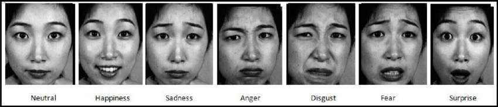

# Representation Learning - Facial Expression recognition dataset 

This folder contains implementations of artificial neural networks and convolutional neural networks on the facial expression recognition dataset.

## File descriptions

The script `facial_expression_recognition.py` contains implementations of artifitial neural networks on a two class problem using  Logistic Regression , and is supported by helper function script `functions.py` .

The script `fer_ann_AB.py`implements artificial neural networks on a complete suite of classes , and has a helper script as `utilities_AB.py`

## Dataset

 

The Facial expression dataset data consists of 48x48 pixel grayscale images of faces. The faces have been automatically registered so that the face is more or less centered and occupies about the same amount of space in each image. The task is to categorize each face based on the emotion shown in the facial expression in to one of seven categories (0=Angry, 1=Disgust, 2=Fear, 3=Happy, 4=Sad, 5=Surprise, 6=Neutral). 

