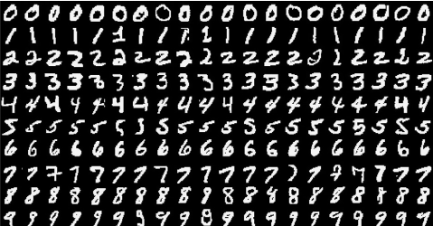

# MNIST

## File description
The folder contains implementations of Convolutional neural network using the  [LeNet](http://yann.lecun.com/exdb/publis/pdf/lecun-01a.pdf) architecture in **Tensorflow** , **Theano** and **Pytorch** in a Class based format. 

### Frameworks
**Files:-** `tensorflow_class_MNIST.py` , `theano_MNIST.py`  consists the same architecture in different frameworks and share a common utility file and helper functions in `cnn_util.py` 
file `tensorflow_MNIST.py` is not written in class based format and hence a bit easier to read.  

`cnn_pytorch.py` shares `util_pyt.py` as its helper file. 

Besides this . The folder also contains Artifitial neural networks in pure numpy with all the backpropagation gradients  calculated at a lower level using the chain rule. It can be found in the file `numpy_MNIST.py` and has helper functions in `util.py`

## Usage
All code and relevant files can be downloaded. The data files can be donloaded from the links in the root folder. **Please place the data files in the folder large_files**.

## License
MIT &copy; [Azeem Bootwala](https://www.linkedin.com/in/azeem-bootwala-19906a39/)

