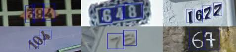

# Street View House Numbers 

The folder contains implementation of **Convolutional Neural network** using Theano and Tensorflow on the SVHN [Street view House Number](http://ufldl.stanford.edu/housenumbers/) dataset.

## Frameworks & File descriptions
The files `CNN_theano_SVHN_AB.py` and `tensorflow_SVHN.py` are *Theano* and *Tensorflow* implementations respectively. Both files are supported by a single helper file `util_AB.py`

## Data-set 

The Data set contains cropped images of street view house numbers for the purpose of classification tasks. 

The implementation is as per the LeNet Architecture adapted to 3-D images. 

## Usage 
All code and relevant files can be downloaded. The data files can be donloaded from the links in the root folder. **Please place the data files in the folder large_files**.

## Licence
MIT &copy; [Azeem Bootwala](https://www.linkedin.com/in/azeem-bootwala-19906a39/)

 

